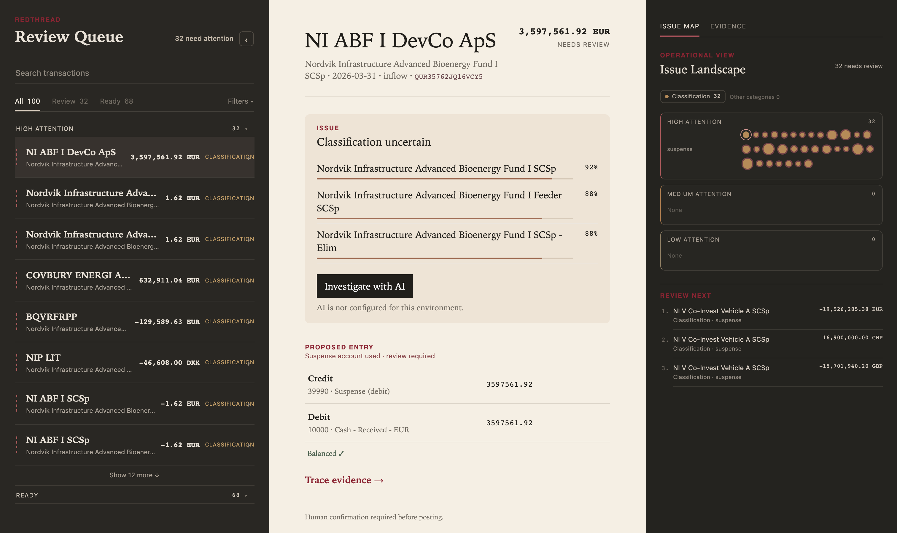
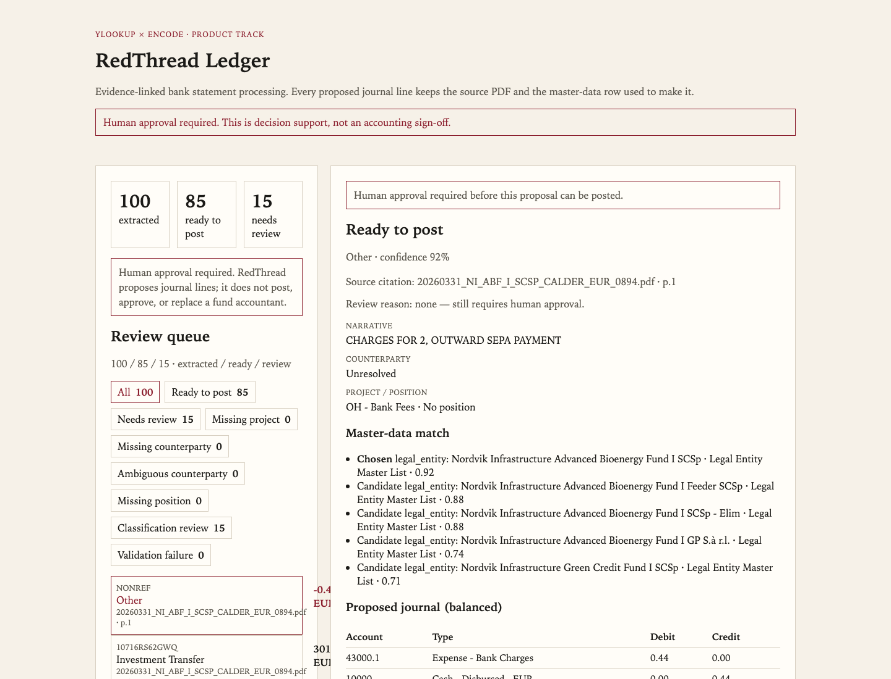

# RedThread Ledger

**Evidence-linked bank statement processing for private-market fund operations.**

RedThread Ledger turns bank statements and fund reference data into reviewable journal entries. Every proposed accounting decision links back to the source transaction and the reference data used to make it.

Built for the **Ylookup × Encode Rebuild Private Markets AI Hackathon — Product Track**.

> **Status:** Deterministic hackathon MVP. Human approval is required before any journal is posted.



The review workspace is three panes: the queue, the proposed journal, and an Issue Map / Evidence trace. Current official-pack result: **100 extracted · 68 ready · 32 needs review**.

## The problem

Fund managers rely on administrators to prepare NAVs, financial statements and investor reporting, but the review process is often slow and repetitive.

In the anonymised Ylookup interview supplied for the hackathon, a fund manager described six or seven review turns for a single NAV, repeated fee errors, numbers that did not reconcile, and a review burden that stayed with the manager. Speed of one pass was not the issue. Trust was.

See [docs/problem-evidence.md](docs/problem-evidence.md).

## Architecture

```text
Seven statement PDFs + 12 allowlisted reference CSVs
        │
        ▼
Transaction extraction (digital PDF text)
        │
        ▼
Legal entity / account resolution
        │
        ▼
Counterparty, project, deal, position matching
        │
        ▼
Rule-based classification
        │
        ▼
Two balanced journal lines
        │
        ▼
Deterministic validation
        │
        ▼
Review workspace (queue · journal · Issue Map / Evidence)
```

The MVP is deterministic. No model API key is required. Matches are limited to supplied master data. Unsupported or ambiguous rows stay **Needs review**. Implausible bank-charge amounts are held for review rather than posted as fees.

An optional Gemini 3.6 exception agent can investigate a Needs-review row when a person clicks **Investigate with AI**. It never posts, never approves, and never changes the original deterministic result. `AGENT_ENABLED` defaults to false.

```text
redthread-ledger/
├── backend/            # extraction, matching, classification, journal, validation, API
├── frontend/           # review workspace: queue, journal, Issue Map, Evidence
├── data/hackathon/     # runtime inputs committed in-repo
│   ├── bank-statements/
│   └── reference-data/
├── data/raw/           # evaluation workbook only (gitignored)
├── evaluation/         # the only code that may open Staging Sheet / DIU
├── tests/
├── deploy/             # Cloud Run spec — not deployed from this repo by default
├── Dockerfile          # single Cloud Run image
├── Makefile
└── README.md
```

## Data boundary

| Runtime input | Forbidden at runtime |
|---|---|
| 7 anonymised statement PDFs | `Staging Sheet` |
| 12 allowlisted reference CSVs | `DIU` |
| Account Map, legal entity, investor, vendor, related party, project, deal/position, CoA, allocation, bank account, Korean/Taiwanese lists | Dataset 02 (GL loader) and dataset 03 (transcripts) |

`evaluation/` is the only package that opens the working workbook. A unit test fails if backend code names those ground-truth sheets.

The official workbook may be copied to gitignored `data/raw/` for `make eval`. It is never an application input.

## Evaluation methodology

`make eval` runs the production pipeline on the seven PDFs, then compares output to the held-out `Staging Sheet` and `DIU` inside `evaluation/` only.

| Area | What we score |
|---|---|
| Statement extraction | Currency and amount against the staging row |
| Counterparty / project / classification / position | Exact normalised match when ground truth has a value |
| Accounting validity | Exactly two journal lines and debit = credit |
| Exception handling | Unmatched counterparties must not be invented |
| Evidence | Source document name and page present |

Known unmatched rows are preserved on purpose. Leaving those as Needs review is a correct outcome.

## Limitations

- A Ready-to-post label is still only a proposal. **Human approval is required.**
- Position and classification accuracy remain below extraction quality; those rows should be reviewed.
- Results depend on the completeness of the supplied master data.
- The MVP does not post to a ledger, produce a NAV, or perform ESG / technology diligence.
- Evaluation uses the official anonymised workbook as ground truth, not as an input.

## Setup

```bash
python3 -m venv .venv
source .venv/bin/activate
pip install -r backend/requirements.txt
cd frontend && npm install && cd ..
cp .env.example .env   # optional; do not add API keys unless enabling the agent
make test
make demo
```

Open http://localhost:3000

Runtime PDFs and reference CSVs are already in `data/hackathon/`. `make demo` does not need `DATASET_ROOT`.

To run evaluation, place the official working workbook in `data/raw/` (or set `DATASET_ROOT` to the organiser pack) and run `make eval`. Never commit that workbook.

```bash
make test
make eval
make lint
```

## Screenshots




## Two-minute demo flow

1. Run `make demo` and open http://localhost:3000.
2. Confirm the three-pane workspace and the note: **human confirmation required before posting**.
3. Confirm the summary: **100 extracted / 68 ready / 32 needs review**.
4. Filter **Ready**. Open a bank-fee row. Check the two balanced journal lines (for example Expense - Bank Charges and Cash - Disbursed).
5. Filter **Review**. Open a classification / suspense row. Confirm it was not given an invented counterparty. Use **Trace evidence** or the Evidence tab to see the source citation.
6. Optional: click **Investigate with AI** if `AGENT_ENABLED=true` and a Gemini key is set. The original deterministic result must stay unchanged.
7. Say aloud: RedThread proposes; a person approves.

## Cloud Run

One public service serves the UI and `/api`. Health: `GET /health`.

One public Cloud Run service. Spec: root `Dockerfile`, `.dockerignore`, and [deploy/README.md](deploy/README.md). Do not pass an API key. Leave `AGENT_ENABLED=false`.

```bash
gcloud auth login
gcloud config set project YOUR_HACKATHON_PROJECT_ID
gcloud services enable run.googleapis.com cloudbuild.googleapis.com artifactregistry.googleapis.com

gcloud run deploy redthread-ledger \
  --source . \
  --region YOUR_HACKATHON_REGION \
  --allow-unauthenticated \
  --port 8080 \
  --memory 1Gi \
  --timeout 300 \
  --set-env-vars DEMO_MODE=true,CORS_ORIGINS=*,AGENT_ENABLED=false
```

## Hackathon submission

- **Track:** Product Track
- **Problem source:** Anonymised fund-manager NAV workflow interview
- **Dataset:** Bank Statements to Journal Entries (runtime PDFs + allowlisted sheets only)
- **Run locally:** `make demo`
- **Demo video:** [https://www.youtube.com/watch?v=naY3fFEiUBM](https://www.youtube.com/watch?v=naY3fFEiUBM)
- **Live application:** Add Cloud Run URL only after a separate deploy step

## Acknowledgements

Built for the Ylookup × Encode Rebuild Private Markets AI Hackathon using the anonymised interviews and fund-operation datasets supplied by Ylookup.
